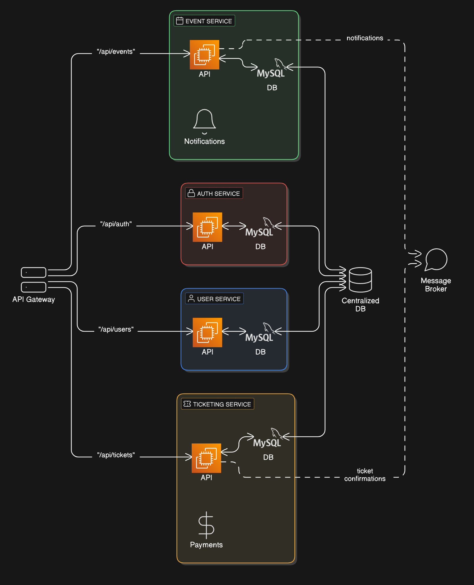

# Ticketing Microservices Project

## Table des matières
1. [Vue d'ensemble](#vue-densemble)
2. [Architecture](#architecture)
3. [Services microservices](#services-microservices)
4. [Technologies utilisées](#technologies-utilisées)
5. [Configuration de l'infrastructure](#configuration-de-linfrastructure)
6. [Guide de démarrage](#guide-de-démarrage)
7. [API Documentation](#api-documentation)
8. [Sécurité](#sécurité)
9. [Tests](#tests)
10. [Monitoring et logs](#monitoring-et-logs)
11. [Choix d'architecture](#choix-darchitecture)
12. [Contributeurs](#contributeurs)

## Vue d'ensemble

Ce projet implémente un système de billetterie pour des concerts et événements basé sur une architecture microservices. Le système est conçu pour être évolutif et capable de gérer des charges de travail variables, des petits événements locaux aux tournées internationales.

### Fonctionnalités principales

- Gestion des événements (création, modification, suppression)
- Gestion des utilisateurs avec différents rôles
- Authentification et autorisation sécurisées
- Achat de billets avec confirmation asynchrone
- Interface API RESTful pour toutes les opérations
- Documentation complète des API avec Swagger

## Architecture


L'application est basée sur une architecture microservices, avec les composants suivants :

- **Nginx** : Sert de reverse proxy public et point d’entrée principal exposé sur le port 9090. Il redirige toutes les requêtes vers le service api-gateway.
- **API Gateway** (Node.js) : Service intermédiaire intelligent, codé en Express.js, qui route les requêtes vers les bons microservices, applique des middlewares (authentification, logs) et centralise les règles de sécurité.
- **Service d'authentification** : Gère l'inscription, la connexion et les tokens JWT
- **Service utilisateur** : Gère les informations des utilisateurs
- **Service événement** : Gère les informations sur les événements et les concerts
- **Service billetterie** : Gère l'achat et la validation des billets
- **RabbitMQ** : Système de messagerie pour la gestion asynchrone des confirmations
- **MySQL** : Base de données relationnelle pour stocker toutes les données

## Services microservices

### Auth Service (port interne 3002, exposé via 3003)
Ce service gère l'authentification et l'inscription des utilisateurs. Il crée et vérifie les tokens JWT utilisés pour sécuriser les autres services.
- Endpoints : `POST /register`, `POST /login`

### User Service (port interne 3003, exposé via 3004)
Ce service gère les informations des utilisateurs, avec des fonctionnalités CRUD accessibles principalement aux administrateurs.
- Endpoints : `POST /`, `GET /`, `GET /me`, `GET /:id`, `PUT /:id`, `DELETE /:id`

### Event Service (port interne 3001, exposé via 3002)
Ce service gère les événements (concerts), permettant leur création, modification et suppression par des créateurs d'événements ou des administrateurs.
- Endpoints : `GET /`, `GET /:id`, `POST /`, `PUT /:id`, `DELETE /:id`

### Ticket Service (port interne 3004, exposé via 3005)
Ce service gère l'achat de billets et envoie des confirmations asynchrones via RabbitMQ.
- Endpoints : `POST /purchase`, `GET /my-tickets`, `GET /all` (opérateurs/admins uniquement)


## 🔄 Flux des requêtes

Voici le chemin parcouru par une requête API dans le système :

1. L’utilisateur fait une requête vers `http://localhost:9090/api/...`
2. **Nginx**, agissant comme reverse proxy, redirige cette requête vers le service `api-gateway` (port `3000`)
3. **Le service `api-gateway`**, codé en Node.js avec Express, utilise `http-proxy-middleware` pour :
    - rediriger dynamiquement vers le bon microservice (`auth`, `event`, `ticket`, `user`)
    - appliquer des middlewares communs (authentification JWT, logs Winston, etc.)
4. Le microservice concerné traite la requête et renvoie une réponse via l’API Gateway.


## Technologies utilisées

- **Backend** : Node.js avec Express et TypeScript
- **Base de données** : MySQL 8.0
- **Message broker** : RabbitMQ 3-management
- **Conteneurisation** : Docker et Docker Compose
- **Proxy inverse et équilibrage de charge** : Nginx
- **Documentation API** : Swagger/OpenAPI 3.0
- **Tests** : Jest et Supertest
- **Logging** : Winston
- **Sécurité** : Bcrypt pour le hachage des mots de passe

## Configuration de l'infrastructure

### Docker Compose

Notre `docker-compose.yml` orchestre tous les services nécessaires. Assurez-vous de définir un fichier `.env` avec les variables suivantes : `DB_HOST`, `DB_USER`, `DB_PASSWORD`, `DB_NAME`, `DB_PORT`, `JWT_SECRET`, `RABBITMQ_URL`, `MYSQL_ROOT_PASSWORD`, `RABBITMQ_DEFAULT_USER`, `RABBITMQ_DEFAULT_PASS`.

```yaml
version: '3.8'
services:
  api-gateway:
    build:
      context: ./api-gateway
      dockerfile: Dockerfile
    ports:
      - "3000:3000"
    depends_on:
      - event-service
      - auth-service
      - user-service
      - ticket-service
    environment:
      - PORT=3000
    networks:
      - ticketing-network

  event-service:
    build:
      context: ./event-service
      dockerfile: Dockerfile
    ports:
      - "3002:3001"
    depends_on:
      mysql:
        condition: service_healthy
    environment:
      - DB_HOST=mysql
      - DB_USER=root
      - DB_PASSWORD=password
      - DB_NAME=ticketing
      - DB_PORT=3306
      - PORT=3001
      - JWT_SECRET=microservices
    volumes:
      - ./event-service/swagger.yaml:/app/swagger.yaml
    networks:
      - ticketing-network

  auth-service:
    build:
      context: ./auth-service
      dockerfile: Dockerfile
    ports:
      - "3003:3002"
    depends_on:
      mysql:
        condition: service_healthy
    environment:
      - DB_HOST=mysql
      - DB_USER=root
      - DB_PASSWORD=password
      - DB_NAME=ticketing
      - DB_PORT=3306
      - PORT=3002
      - JWT_SECRET=microservices
    volumes:
      - ./auth-service/swagger.yaml:/app/swagger.yaml
    networks:
      - ticketing-network

  user-service:
    build:
      context: ./user-service
      dockerfile: Dockerfile
    ports:
      - "3004:3003"
    depends_on:
      mysql:
        condition: service_healthy
    environment:
      - DB_HOST=mysql
      - DB_USER=root
      - DB_PASSWORD=password
      - DB_NAME=ticketing
      - DB_PORT=3306
      - PORT=3003
      - JWT_SECRET=microservices
    volumes:
      - ./user-service/swagger.yaml:/app/swagger.yaml
    networks:
      - ticketing-network

  ticket-service:
    build:
      context: ./ticket-service
      dockerfile: Dockerfile
    ports:
      - "3005:3004"
    depends_on:
      mysql:
        condition: service_healthy
      rabbitmq:
        condition: service_started
    environment:
      - DB_HOST=mysql
      - DB_USER=root
      - DB_PASSWORD=password
      - DB_NAME=ticketing
      - DB_PORT=3306
      - PORT=3004
      - JWT_SECRET=microservices
      - RABBITMQ_URL=amqp://rabbitmq:5672
    volumes:
      - ./ticket-service/swagger.yaml:/app/swagger.yaml
    networks:
      - ticketing-network

  mysql:
    image: mysql:8.0
    environment:
      MYSQL_ROOT_PASSWORD: password
      MYSQL_DATABASE: ticketing
    ports:
      - "3306:3306"
    volumes:
      - mysql-data:/var/lib/mysql
    networks:
      - ticketing-network
    healthcheck:
      test: ["CMD", "mysqladmin", "ping", "-h", "localhost", "-u", "root", "-ppassword"]
      timeout: 5s
      retries: 10
      interval: 5s

  rabbitmq:
    image: rabbitmq:3-management
    ports:
      - "5672:5672"  # Port AMQP
      - "15672:15672"  # Port de gestion (UI)
    environment:
      - RABBITMQ_DEFAULT_USER=guest
      - RABBITMQ_DEFAULT_PASS=guest
    volumes:
      - rabbitmq-data:/var/lib/rabbitmq
    healthcheck:
      test: ["CMD", "rabbitmqctl", "status"]
      interval: 10s
      timeout: 5s
      retries: 5
    networks:
      - ticketing-network

  nginx:
    image: nginx:latest
    ports:
      - "9090:80"
    volumes:
      - ./nginx/nginx.conf:/etc/nginx/nginx.conf
    depends_on:
      - api-gateway
    networks:
      - ticketing-network

networks:
  ticketing-network:
    driver: bridge

volumes:
  mysql-data:
  rabbitmq-data:
```
*Les volumes `mysql-data` et `rabbitmq-data` assurent la persistance des données de MySQL et RabbitMQ entre les redémarrages.*

### Configuration Nginx (Load Balancer)

```nginx
events {
  worker_connections 1024;
}

http {
  upstream event_service {
    server event-service:3001;
  }

  upstream auth_service {
    server auth-service:3002;
  }

  upstream user_service {
    server user-service:3003;
  }

  upstream ticket_service {
    server ticket-service:3004;
  }

  server {
    listen 80;

    # Routes API pour les différents services
    location /api/events {
      proxy_pass http://event_service/api/events;
      proxy_set_header Host $host;
      proxy_set_header X-Real-IP $remote_addr;
    }

    location /api/auth {
      proxy_pass http://auth_service/api/auth;
      proxy_set_header Host $host;
      proxy_set_header X-Real-IP $remote_addr;
    }

    location /api/users {
      proxy_pass http://user_service/api/users;
      proxy_set_header Host $host;
      proxy_set_header X-Real-IP $remote_addr;
    }

    location /api/tickets {
      proxy_pass http://ticket_service/api/tickets;
      proxy_set_header Host $host;
      proxy_set_header X-Real-IP $remote_addr;
    }

    # Documentation Swagger pour chaque service
    location /event-docs {
      proxy_pass http://event_service/api-docs;
      proxy_set_header Host $host;
      proxy_set_header X-Real-IP $remote_addr;
    }

    location /auth-docs {
      proxy_pass http://auth_service/api-docs;
      proxy_set_header Host $host;
      proxy_set_header X-Real-IP $remote_addr;
    }

    location /user-docs {
      proxy_pass http://user_service/api-docs;
      proxy_set_header Host $host;
      proxy_set_header X-Real-IP $remote_addr;
    }

    location /ticket-docs {
      proxy_pass http://ticket_service/api-docs;
      proxy_set_header Host $host;
      proxy_set_header X-Real-IP $remote_addr;
    }

    # Redirection par défaut vers la documentation des événements
    location / {
      return 302 /event-docs;
    }
  }
}
```

### Configuration RabbitMQ

RabbitMQ est utilisé pour gérer les confirmations d'achat de billets de manière asynchrone. Le service ticket envoie un message dans une file d'attente lorsqu'un billet est acheté, et un consommateur traite ces messages pour envoyer les confirmations.

```typescript
// Envoyer un message à la file pour confirmation
export const sendToQueue = async (message: string) => {
  try {
    const ch = await connectRabbitMQ();
    ch.sendToQueue('ticket_confirmation', Buffer.from(message), { persistent: true });
  } catch (error) {
    logger.error(`Impossible d'envoyer le message à RabbitMQ: ${error}`);
    // Ne pas propager l'erreur pour éviter de bloquer le service
  }
};

// Consommer les messages de la file (simulation email/SMS)
export const consumeQueue = async () => {
  try {
    const ch = await connectRabbitMQ();
    ch.consume('ticket_confirmation', (msg: ConsumeMessage | null) => {
      if (msg) {
        const content = msg.content.toString();
        logger.info(`Confirmation envoyée (simulation) : ${content}`);
        ch.ack(msg);
      }
    }, { noAck: false });
  } catch (error) {
    logger.error(`Impossible de consommer les messages RabbitMQ: ${error}`);
    throw error;
  }
};
```

## Guide de démarrage

### Prérequis

- Docker et Docker Compose
- Node.js et npm (pour le développement)
- Git

### Étapes d'installation

1. Cloner le dépôt :
   ```bash
   git clone https://github.com/TheAgentMaro/ticketing-microservices-project.git
   cd ticketing-microservices-project
   ```

2. Démarrer les services avec Docker Compose :
   ```bash
   docker-compose up --build
   ```

3. Accéder à l'application :
   - API Gateway : http://localhost:3000
   - Nginx : http://localhost:9090
   - Documentation Swagger :
     | Service | URL |
     |--------|-----|
     | Events | [http://localhost:3002/api-docs](http://localhost:3002/api-docs) |
     | Auth   | [http://localhost:3003/api-docs](http://localhost:3003/api-docs) |
     | Users  | [http://localhost:3004/api-docs](http://localhost:3004/api-docs) |
     | Tickets| [http://localhost:3005/api-docs](http://localhost:3005/api-docs) |
   - RabbitMQ Management : http://localhost:15672 (guest/guest)

## API Documentation

Chaque service possède sa propre documentation Swagger accessible via les URL mentionnées ci-dessus. Voici un aperçu des principales API :

### Auth Service API
- `POST /api/auth/register` : Inscription d’un utilisateur
- `POST /api/auth/login` : Connexion utilisateur et génération de token JWT

### User Service API
- `POST /api/users` : Créer un utilisateur (admin uniquement)
- `GET /api/users` : Liste des utilisateurs (admin uniquement)
- `GET /api/users/me` : Récupérer ses propres données
- `GET /api/users/{id}` : Récupérer un utilisateur spécifique
- `PUT /api/users/{id}` : Mettre à jour un utilisateur (admin uniquement)
- `DELETE /api/users/{id}` : Supprimer un utilisateur (admin uniquement)

### Event Service API
- `GET /api/events` : Liste de tous les événements
- `GET /api/events/{id}` : Récupérer un événement spécifique
- `POST /api/events` : Créer un événement (event_creator ou admin)
- `PUT /api/events/{id}` : Mettre à jour un événement (event_creator ou admin)
- `DELETE /api/events/{id}` : Supprimer un événement (event_creator ou admin)

### Ticket Service API
- `POST /api/tickets/purchase` : Acheter un billet
- `GET /api/tickets/my-tickets` : Récupérer les billets de l’utilisateur connecté
- `GET /api/tickets/all` : Récupérer tous les billets (operator ou admin)

## Sécurité

### Authentification

L’authentification est gérée par le service d’authentification qui émet des tokens JWT. Ces tokens contiennent l’ID de l’utilisateur, son nom d’utilisateur et son rôle, et sont vérifiés par chaque service via un middleware `authenticateToken`.

### Autorisation

Les rôles suivants sont implémentés avec des permissions différentes :
- **admin** : Accès complet à toutes les fonctionnalités
- **event_creator** : Création et gestion des événements
- **operator** : Fonctionnalités opérationnelles (pas encore implémentées)
- **user** : Achat de billets et accès en lecture seule

### Hachage des mots de passe

Les mots de passe sont stockés de manière sécurisée avec bcrypt :

```typescript
export const createUser = async (user: User): Promise<User> => {
  const hashedPassword = await bcrypt.hash(user.password, 10);
  const query = 'INSERT INTO users (username, password, role) VALUES (?, ?, ?)';
  const [result] = await pool.query(query, [user.username, hashedPassword, user.role]);
  const insertId = (result as any).insertId;
  return { id: insertId, username: user.username, password: hashedPassword, role: user.role };
};
```

## Tests

Chaque service comprend des tests unitaires et d'intégration utilisant Jest et Supertest. Les tests peuvent être exécutés avec :

```bash
cd [service-directory]
npm test
```

Exemple de test pour le contrôleur d'authentification :

```typescript
describe('Auth Controller', () => {
  it('should register a user', async () => {
    const res = await request(app)
      .post('/api/auth/register')
      .send({ username: 'testuser', password: 'testpass', role: 'user' });
    expect(res.status).toBe(201);
    expect(res.body.username).toBe('testuser');
  });

  it('should login a user', async () => {
    await request(app)
      .post('/api/auth/register')
      .send({ username: 'loginuser', password: 'loginpass', role: 'user' });
    const res = await request(app)
      .post('/api/auth/login')
      .send({ username: 'loginuser', password: 'loginpass' });
    expect(res.status).toBe(200);
    expect(res.body.token).toBeDefined();
  });
});
```

## Monitoring et logs

### Logging

Le système utilise Winston pour la journalisation. Les logs sont enregistrés dans des fichiers et également affichés dans la console :

```typescript
const logger = winston.createLogger({
  level: 'info',
  format: winston.format.combine(
    winston.format.timestamp({ format: 'YYYY-MM-DD HH:mm:ss' }),
    winston.format.json()
  ),
  transports: [
    new winston.transports.File({ filename: 'error.log', level: 'error' }),
    new winston.transports.File({ filename: 'combined.log' }),
    new winston.transports.Console({
      format: winston.format.combine(
        winston.format.colorize(),
        winston.format.simple()
      ),
    }),
  ],
});
```

## Choix d'architecture

### Pourquoi les microservices ?

1. **Scalabilité** : Chaque service peut être mis à l'échelle indépendamment selon ses besoins
2. **Résilience** : La défaillance d'un service n'affecte pas l'ensemble du système
3. **Technologie adaptée** : Chaque service peut utiliser la technologie la plus adaptée à sa fonction
4. **Développement parallèle** : Les équipes peuvent travailler en parallèle sur différents services

### Pourquoi Nginx ?
Utilisé comme API Gateway pour unifier les points d’entrée et répartir la charge entre les services.

### Pourquoi RabbitMQ ?

Pour la gestion des confirmations de billets, nous avons choisi RabbitMQ car :
1. **Fiabilité** : Les messages persistants garantissent qu'aucune confirmation n'est perdue
2. **Asynchronisme** : Le processus d'achat n'est pas bloqué par l'envoi de confirmations
3. **Scaling** : Plusieurs consommateurs peuvent traiter les messages en parallèle

### Pourquoi MySQL ?

MySQL a été choisi comme base de données car :
1. **Intégrité référentielle** : Important pour les relations entre utilisateurs, événements et billets
2. **Transactions ACID** : Cruciales pour l'achat de billets afin d'éviter la survente
3. **Familiarité** : Solution éprouvée avec un large support communautaire

## Contributeurs

- Med Marwen Meddeb

## Licence

Ce projet est sous licence MIT. Voir le fichier LICENSE pour plus de détails.
